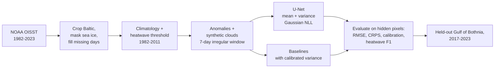
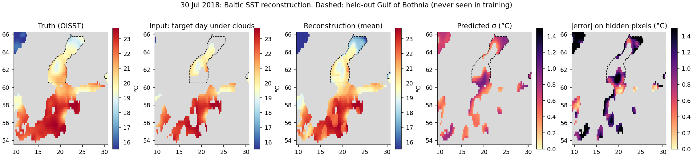
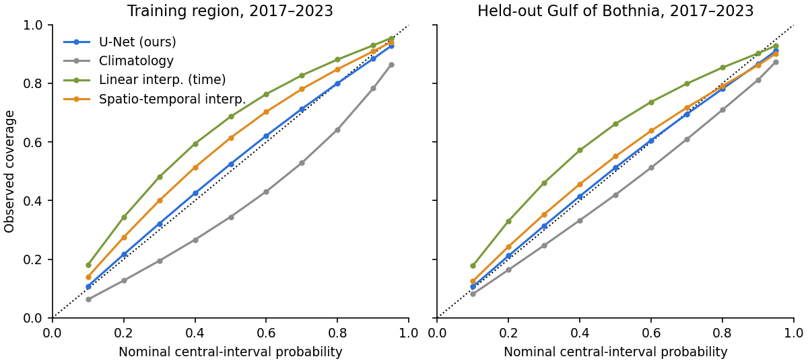
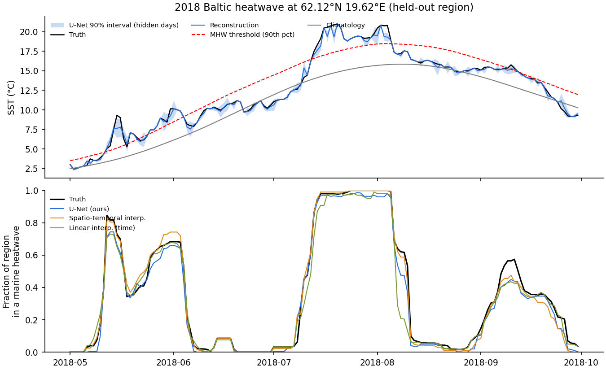

# Probabilistic gap-filling of Baltic Sea surface temperature

A small neural network reconstructs daily Baltic sea-surface temperature (SST) under cloud-like gaps and
outputs a **mean and an uncertainty for every pixel**. It is evaluated in a **region it never saw during
training** (the Gulf of Bothnia), in **held-out years** (2017–2023), and on a downstream task:
whether the reconstructions still detect **marine heatwaves**, including the record Baltic summer of 2018.

The question behind it: *how can a model learn from observations that are incomplete, irregular in time,
and uneven in space, and still say how much it doesn't know, especially during extremes?*
This is a short exploratory project: the goal was to get hands-on with this kind of Earth-observation
data, find out what is actually hard about it, and document that honestly.




*30 July 2018. From left: truth, what the model sees on the target day (≈30–70 % hidden), reconstruction,
predicted standard deviation, absolute error on hidden pixels. The dashed outline is the held-out Gulf of
Bothnia. The Norwegian Sea corner (top left) and the Åland/Gulf of Finland buffer are never trained on or
scored; their large errors are left visible on purpose.*

## Results

Test years 2017–2023, scored only on pixels hidden from the model. SST in °C. Best in **bold**.

**Held-out region: Gulf of Bothnia (never seen in training, not even as input)**

| Method | RMSE ↓ | CRPS ↓ | 90 % interval coverage | RMSE on MHW days ↓ | CRPS on MHW days ↓ | 90 % coverage on MHW days | MHW-day F1 ↑ |
|---|---|---|---|---|---|---|---|
| Climatology | 1.815 | 0.932 | 0.812 | 3.260 | 2.127 | 0.281 | 0.002 |
| Linear interpolation in time | 0.680 | 0.280 | 0.903 | 1.045 | 0.400 | 0.838 | 0.893 |
| Spatio-temporal interpolation | **0.497** | 0.251 | 0.862 | **0.606** | **0.304** | 0.811 | 0.895 |
| **U-Net, Gaussian NLL (ours)** | 0.540 | **0.227** | 0.866 | 0.907 | 0.415 | 0.726 | **0.902** |

**Training region (south and central Baltic), same test years**

| Method | RMSE ↓ | CRPS ↓ | 90 % coverage | RMSE on MHW days ↓ | CRPS on MHW days ↓ | 90 % coverage on MHW days | MHW-day F1 ↑ |
|---|---|---|---|---|---|---|---|
| Climatology | 1.841 | 1.041 | 0.783 | 2.802 | 1.883 | 0.365 | 0.002 |
| Linear interpolation in time | 0.621 | 0.252 | 0.930 | 0.844 | 0.306 | 0.912 | 0.910 |
| Spatio-temporal interpolation | **0.390** | 0.201 | 0.910 | **0.396** | **0.200** | 0.910 | 0.922 |
| **U-Net, Gaussian NLL (ours)** | 0.391 | **0.175** | 0.884 | 0.537 | 0.241 | 0.817 | **0.934** |

MHW = marine heatwave. 866k hidden pixel-days are scored in the training region and 315k in Bothnia;
287k and 74k of them are heatwave days.

### What the numbers say

1. **The network wins on probabilistic skill, not on point accuracy.** It has the best CRPS in both
   regions, because its uncertainty adapts to each pixel, for example to how many clear days are nearby.
   A well-tuned spatio-temporal interpolation is as accurate or more accurate in RMSE. On a smooth,
   low-resolution field like OISST, simple baselines are strong, and a learned model is not automatically
   better.
2. **Transfer to a new region costs accuracy, while calibration mostly holds.** RMSE rises from 0.39 to
   0.54 °C in Bothnia, which is colder, partly ice-covered and shaped differently. The calibration curve
   stays close to the diagonal (below).
3. **Extremes are the weak point, and this is the most interesting result.** On heatwave days in Bothnia
   the network's error nearly doubles (0.54 → 0.91 °C) and its 90 % intervals cover only 73 % of the
   truth. It pulls extremes back toward the mean and is overconfident exactly when it matters.
   Interpolation, which has no learned prior, does not suffer from this. See *Limitations*.
4. **Heatwave detection is robust for all reasonable methods (F1 ≈ 0.90).** Events last for days and
   cover large areas, so partial observations anchor them. Climatology predicts no anomaly and therefore
   detects nothing. This is a sanity check rather than a discriminating metric.
5. **The world is not stationary.** The climatology baseline's intervals are too narrow (78–81 % instead
   of 90 %) because the 1982–2011 baseline is colder and less variable than 2017–2023.


*Observed vs nominal coverage of central predictive intervals. On the diagonal = calibrated. The baselines'
variances are fitted on validation data, so they are fair probabilistic competitors.*


*Top: one Bothnian Sea pixel through summer 2018, with the U-Net's 90 % interval on days that pixel was
hidden. Bottom: fraction of the held-out region in a marine heatwave, from the truth and from each
reconstruction.*

## Method

**Data.** [NOAA OISST v2.1](https://www.ncei.noaa.gov/products/optimum-interpolation-sst), daily, 0.25°,
1982–2023, cropped to 53.5–66 °N, 9.5–30.5 °E (51 × 85 cells). It is downloaded from NOAA ERDDAP. The
1,192 days missing from that aggregation (mostly 1992–1998) are filled from NCEI's per-day files, and
values were checked to agree to 10⁻⁶ °C on overlapping days. Pixels with sea-ice concentration > 15 % are
treated as invalid everywhere, because OISST pins them near freezing.

**Target.** The model reconstructs the SST *anomaly* relative to a 1982–2011 day-of-year climatology,
so it does not have to relearn the seasonal cycle. The climatology and the heatwave threshold follow
Hobday et al. (2016): an 11-day window pooled over 30 years, then a 31-day moving average. The threshold
is the 90th percentile.

**Gaps.** Clouds are simulated as spatially correlated blobs (Gaussian-filtered noise, σ ≈ 0.75°)
hiding 30–70 % of the ocean each day. The model sees a 7-day window centred on the target day. Each of
the other six days is missing *entirely* with probability 0.3, so the time sampling is irregular. Training
draws new clouds every epoch. Evaluation uses fixed seeds, so all methods see identical gaps.

**Splits.** Time: train 1982–2013, validation 2014–2016, test 2017–2023 (which includes the 2018
heatwave). Space: the Gulf of Bothnia (north of 60.5 °N) is held out. During training it is blanked out
of the *input* as if it were land, not just excluded from the loss. A buffer zone (Åland Sea, Gulf of
Finland) is used by neither side, to limit leakage through spatial autocorrelation.

**Model.** A 3-level U-Net with 1.9 M parameters. Its 19 input channels are 7 days of observed
anomalies, 7 observation masks, an ocean mask, day-of-year sin/cos, and the climatological mean and
standard deviation. It has two output heads: μ, and σ² via softplus.

**Loss: Gaussian negative log-likelihood** on hidden pixels only, a masked-reconstruction objective:
`½ log σ² + (y − μ)² / 2σ²`. MSE would train only μ. With NLL, the model is penalised both for errors
and for misjudging how large its errors are, so σ is learned rather than bolted on. It also
down-weights pixels that are inherently hard to fill, instead of letting them dominate the gradient.

**Baselines.** (1) Climatology, with zero anomaly and the interannual standard deviation as spread.
(2) Linear interpolation in time per pixel between the nearest clear days, falling back to persistence
and then to climatology. (3) Spatio-temporal normalised convolution, a Gaussian-weighted average of all
clear pixels nearby in space and time and a cheap stand-in for kriging. Baselines 2 and 3 get a
predictive variance fitted on validation data, binned by how much data is nearby.

**Metrics.** RMSE; CRPS (closed form for Gaussians); coverage of central intervals; and marine
heatwave days detected on each reconstruction with the Hobday definition (≥ 5 days above the threshold,
gaps ≤ 2 days merged), compared with detection on the true field using F1 on hidden pixel-days.

## Reproduce

```bash
pip install -r requirements.txt
./run.sh
```

`run.sh` runs `src/data.py` (download, ~15 min, cached), then `src/train.py` (~30 min on an Apple GPU;
CUDA and CPU also work), `src/evaluate.py` and `src/figures.py`. Every setting is in
[`config.yaml`](config.yaml), and seeds are fixed. A trained checkpoint is included at
`results/model.pt`, so `python src/evaluate.py && python src/figures.py` reproduces the tables and figures
without retraining.

```
src/data.py       download, climatology/MHW threshold, region split, synthetic clouds, Dataset
src/model.py      U-Net with mean and variance heads, Gaussian NLL
src/train.py      training loop, best checkpoint by validation NLL
src/baselines.py  climatology, temporal and spatio-temporal interpolation, variance calibration
src/evaluate.py   RMSE, CRPS, coverage, marine heatwave detection, per region
src/figures.py    the three figures above
```

## Problems found and fixed along the way

Some of the most useful lessons came from things that went wrong:

- **Silent gaps in the source data.** The ERDDAP aggregation of OISST is missing 1,192 days (mostly
  1992–1998). Nothing crashed, but a "7-day window" would have silently spanned weeks and biased the
  climatology. The gaps were caught by counting days per year. They are filled from NCEI's per-day
  files (checked against ERDDAP to 10⁻⁶ °C), and the dataset is forced onto a full daily calendar so
  this cannot happen silently again.
- **A wrong test region, caught on a map.** "North of 60.5 °N" also selected the Norwegian Sea. No metric
  showed it; the first plotted map did. The held-out region is now Bothnia only.
- **NaN leakage at evaluation.** 32 Bothnian pixel-days were ice-free in 2016–17 but ice-covered on that
  calendar day in every baseline year, so they had no climatology. Because the network sees the whole
  Baltic at test time, one NaN input spread through the convolutions into every region's scores. Such
  pixels are now invalid. This is a small, concrete case of the climate leaving its baseline range.
- **Compute.** CPU training would have taken hours; one benchmark showed the Apple GPU (MPS) was 3×
  faster, so the device is now picked automatically. The whole pipeline was first run end to end on two
  years of data to catch bugs before the full run.

## Limitations and next steps

- **Synthetic gaps on an already gap-filled product.** OISST is itself an optimal interpolation of
  satellite and in-situ data, so the "truth" is smooth and the clouds are random blobs. Real cloud cover
  is correlated with weather, and therefore with heatwaves: clear skies and calm seas go together.
  The next step is to train on real L3 satellite SST with its real gaps (e.g. Copernicus Baltic L3S), so
  that missingness is informative rather than random.
- **SST only.** Heatwaves are driven by the atmosphere. Fusing ERA5 air temperature, wind and radiation,
  together with in-situ buoy and station time series that come at other resolutions and sampling times,
  is a *multimodal and multiscale* problem rather than a channel-stacking one.
- **A fixed grid.** A CNN on a regular grid treats a 0.25° cell of narrow archipelago like open sea and
  has no natural place for point sensors. A graph or mesh model (*geometric deep learning*) could
  represent coastlines, sensors and land–sea–atmosphere coupling directly.
- **Gaussian uncertainty fails at the extremes.** On heatwave days in the held-out region, the 90 %
  intervals cover only 73 %. Heavy-tailed or quantile-based outputs, conformal recalibration under
  distribution shift, or explicit extreme-value modelling are the obvious next things to test.
- **Small study.** One seed, one architecture, no hyperparameter search, and validation NLL was still
  falling after 8 epochs. The differences between the U-Net and spatio-temporal interpolation in RMSE
  are within what a second seed might change.

**Try it:** change `gaps.frac_range` in `config.yaml` (e.g. `[0.7, 0.9]`) and retrain, or evaluate the
existing model at a fixed gap fraction with `python src/evaluate.py --frac 0.8 --out results/metrics_frac08.json`.

## Notes

Built with AI coding assistance (Claude); the design choices, checks and write-up were reviewed by me.
Data: NOAA OISST v2.1 (Huang et al., 2021, *J. Climate*). Heatwave definition: Hobday et al., 2016,
*Progress in Oceanography*.
